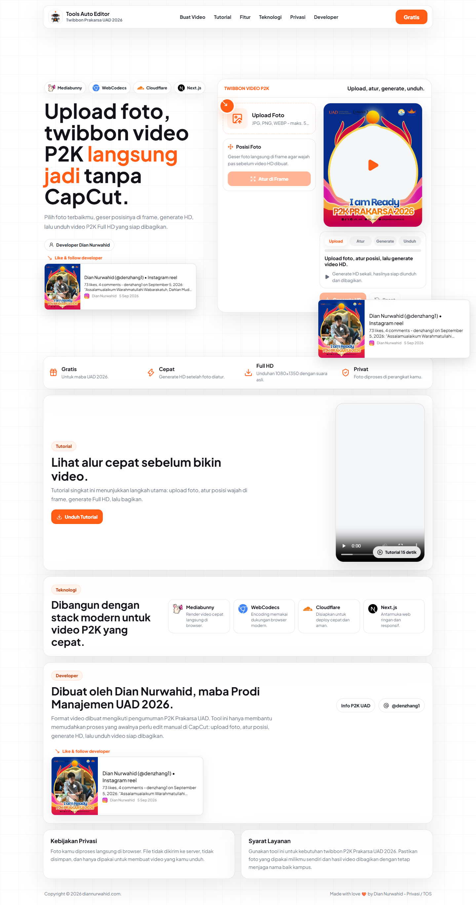
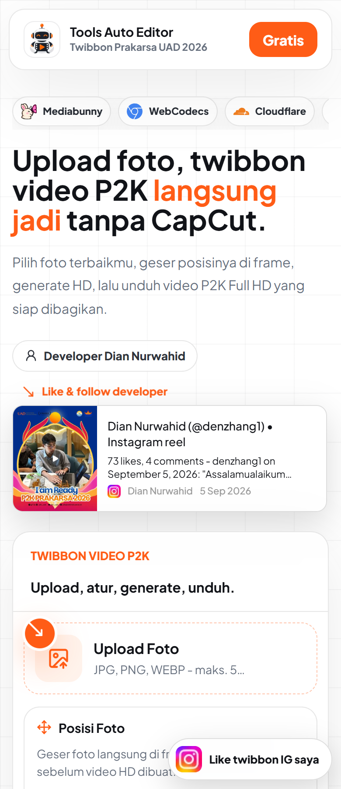
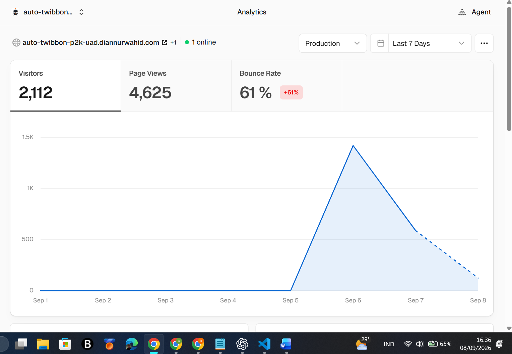

# P2K Tools Auto Editor

Tools Auto Editor Twibbon Prakarsa UAD 2026 adalah web app untuk membantu
mahasiswa baru Universitas Ahmad Dahlan membuat video twibbon P2K dengan lebih
cepat. Cukup upload foto, atur posisi wajah di frame, generate video HD, lalu
unduh dan bagikan ke Instagram.

Project ini dibuat oleh Dian Nurwahid, maba Prodi Manajemen UAD 2026, sebagai
alat bantu agar proses yang sebelumnya perlu edit manual di CapCut bisa
dilakukan dari satu halaman web yang ringan dan mudah dipakai.

## Live Website

Production URL:

**[auto-twibbon-p2k-uad.diannurwahid.com](https://auto-twibbon-p2k-uad.diannurwahid.com/)**

## Preview

Tampilan landing page dibuat clean, light, dan fokus pada alur utama: upload
foto, atur frame, generate video HD, lalu unduh atau bagikan.

### Desktop



### Mobile



## Highlights

- Upload foto JPG, PNG, atau WEBP dengan batas maksimal 5MB.
- Editor posisi foto interaktif langsung di frame twibbon.
- Generate video HD dengan suara template tetap aman.
- Caption P2K otomatis yang bisa disesuaikan dengan nama, prodi, dan fakultas.
- Tombol bagikan untuk Instagram Post, Reels, Story, dan unduh file HD.
- Mode FEB Twibbon dengan template Fakultas Ekonomi dan Bisnis bawaan dari
  tools, plus deteksi timing greenscreen dan kontrol koreksi manual.
- Popup panduan browser jika pengguna membuka dari Instagram browser atau
  browser yang membatasi akses file.
- Proses foto berjalan di browser pengguna, bukan dikirim ke server.

## Analytics & Impact

Dalam masa awal penggunaan, tool ini mulai dipakai oleh banyak maba UAD untuk
membuat dan membagikan Twibbon Video P2K Prakarsa UAD 2026.



Ringkasan analytics per 8 September 2026:

| Metric | Result |
| --- | ---: |
| Visitors | 2,112 |
| Page Views | 4,625 |
| Bounce Rate | 61% |
| Online saat screenshot | 1 user |

Impact utama:

- Membantu mahasiswa baru membuat video twibbon tanpa workflow edit manual.
- Mengurangi hambatan teknis untuk ikut meramaikan publikasi P2K.
- Membuat proses upload, penyesuaian frame, generate video, dan caption menjadi
  satu alur yang lebih sederhana.
- Menjadi portofolio nyata yang digunakan langsung oleh audiens kampus.

## Tech Stack

Project ini dibangun dengan fokus pada pengalaman pengguna yang cepat dan ringan.

| Stack | Peran |
| --- | --- |
| Next.js | Framework utama untuk UI dan routing app. |
| React | Komponen interaktif untuk editor, popup, dan state aplikasi. |
| Mediabunny | Pemrosesan media MP4 langsung di browser. |
| WebCodecs | Decode/encode video dengan dukungan browser modern. |
| WebGL | Compositing frame, chroma key, dan foto secara cepat. |
| Vercel Analytics | Melihat jumlah pengunjung dan page views. |

## Privacy

Foto pengguna diproses langsung di browser. File foto tidak dikirim ke server,
tidak disimpan oleh aplikasi, dan hanya digunakan untuk membuat video yang
diunduh oleh pengguna.

Untuk hasil terbaik, pengguna disarankan membuka web lewat Chrome, Edge, Safari,
atau browser utama perangkat. Beberapa in-app browser seperti Instagram browser
dapat membatasi akses file dan proses download video.

## Local Development

Install dependencies:

```bash
npm install
```

Run development server:

```bash
npm run dev
```

Build production:

```bash
npm run build
```

Run production server:

```bash
npm run start
```

## Project Notes

Template video P2K hanya digunakan untuk kebutuhan Twibbon Prakarsa UAD 2026.
Format video mengikuti kebutuhan publikasi P2K, sementara tool ini berperan
sebagai alat bantu agar maba lebih mudah membuat hasil akhirnya.

## License

Copyright (c) 2026 Dian Nurwahid. All rights reserved.

Repository ini boleh dilihat secara publik untuk transparansi, portofolio, dan
referensi pembelajaran. Namun kode, desain, aset, template, dan dokumentasi di
project ini tidak boleh dicopy, dimodifikasi, didistribusikan, dideploy ulang,
atau digunakan untuk project/produk lain tanpa izin tertulis dari Dian Nurwahid.

Jika izin diberikan, sumber wajib dicantumkan:

`Source: Dian Nurwahid - https://diannurwahid.com`

Detail lengkap ada di [LICENSE](LICENSE).
